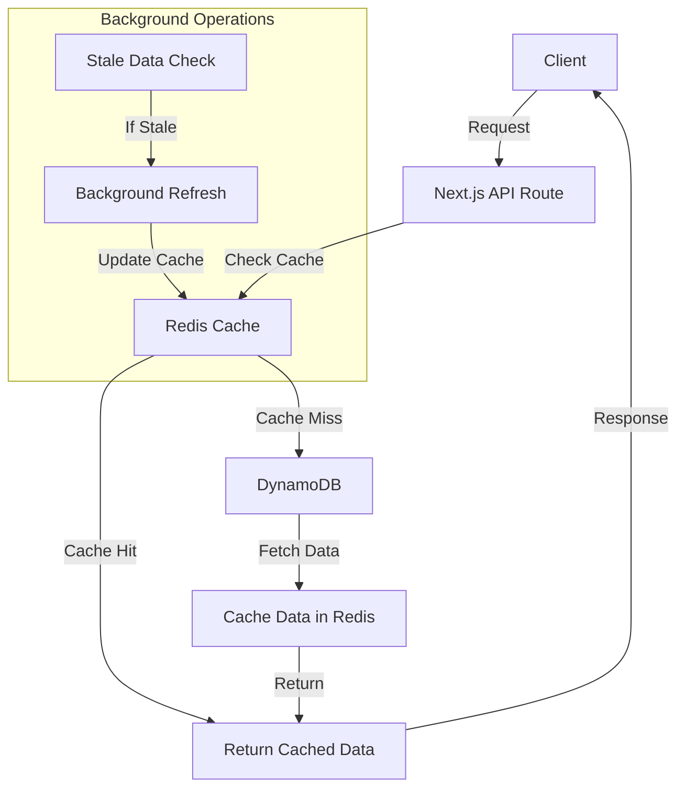

# DynamoDB Admin Application

A Next.js application for managing and viewing DynamoDB tables with advanced caching capabilities.

## Architecture Overview

The application follows a multi-layered architecture with the following components:

1. **Frontend Layer (React/Next.js)**
   - React components for UI rendering
   - Next.js API routes for server-side operations
   - Client-side state management

2. **API Layer**
   - RESTful endpoints for DynamoDB operations
   - Cache management endpoints
   - Background refresh handlers

3. **Cache Layer (Redis)**
   - Redis client for caching operations
   - Data compression and chunking
   - Cache invalidation mechanisms

4. **DynamoDB Layer**
   - AWS DynamoDB client
   - Table operations
   - Query execution

## Data Flow Diagram



## Key Components

### 1. Frontend Components

- **TableDetails**: Main component for displaying table information
- **DataCard**: Component for displaying individual items
- **CardView**: Grid view of data cards
- **CacheStats**: Component for displaying cache statistics

### 2. Cache Service

The cache service implements several key features:

- **Stale-While-Revalidate Pattern**
  - Returns stale data immediately
  - Refreshes data in background
  - Configurable stale thresholds

- **Data Chunking**
  - Splits large datasets into 512KB chunks
  - Compresses data using zlib
  - Efficient network transfer

- **Cache Keys**
  - Structured naming convention
  - Different TTLs for different data types
  - Pattern-based invalidation

### 3. Redis Client

The Redis client handles:

- Connection management
- Data compression
- Chunking mechanism
- Error handling
- Connection pooling

### 4. API Routes

Key API endpoints:

- `/api/admin/dynamodb/tables/[tableName]`
  - GET: Fetch table details and items
  - DELETE: Invalidate cache
- `/api/admin/cache/warmup`
  - POST: Prefetch popular data

## Data Flow Process

1. **Initial Request**
   - Client requests table data
   - API route checks Redis cache
   - Returns cached data if available

2. **Cache Miss**
   - Fetches data from DynamoDB
   - Caches data in Redis
   - Returns data to client

3. **Stale Data**
   - Returns stale data immediately
   - Triggers background refresh
   - Updates cache asynchronously

4. **Background Operations**
   - Monitors cache health
   - Prefetches popular data
   - Maintains cache statistics

## Configuration

The application uses environment variables for configuration:

- `REDIS_URL`: Redis connection string
- `TABLE_LIST_TTL`: TTL for table list (default: 30 minutes)
- `TABLE_DETAILS_TTL`: TTL for table details (default: 1 hour)
- `TABLE_ITEMS_TTL`: TTL for table items (default: 30 minutes)
- `QUERY_RESULTS_TTL`: TTL for query results (default: 15 minutes)
- `STATS_TTL`: TTL for cache statistics (default: 24 hours)
- `STALE_THRESHOLD`: Threshold for stale data (default: 75%)

## Performance Optimizations

1. **Data Compression**
   - Uses zlib for compression
   - Reduces network transfer size
   - Improves cache efficiency

2. **Chunking**
   - 512KB chunk size
   - Parallel processing
   - Memory optimization

3. **Connection Pooling**
   - Reuses Redis connections
   - Reduces connection overhead
   - Improves response times

4. **Background Refresh**
   - Non-blocking operations
   - Stale-while-revalidate
   - Improved user experience

## Error Handling

The application implements robust error handling:

- Redis connection failures
- DynamoDB operation errors
- Cache invalidation issues
- Background refresh failures

## Monitoring

Cache performance is monitored through:

- Hit/miss statistics
- Stale data tracking
- Per-table statistics
- Background refresh metrics

# Next.js Project

This is a [Next.js](https://nextjs.org/) project bootstrapped with custom configuration.

## Getting Started

First, install the dependencies:

```bash
npm install
# or
yarn install
# or
pnpm install
```

Then, run the development server:

```bash
npm run dev
# or
yarn dev
# or
pnpm dev
```

Open [http://localhost:3000](http://localhost:3000) with your browser to see the result.

You can start editing the page by modifying `src/app/page.tsx`. The page auto-updates as you edit the file.

## Learn More

To learn more about Next.js, take a look at the following resources:

- [Next.js Documentation](https://nextjs.org/docs) - learn about Next.js features and API.
- [Learn Next.js](https://nextjs.org/learn) - an interactive Next.js tutorial.

## Project Structure

- `src/app/` - Contains the application routes and pages
- `src/components/` - Reusable UI components
- `src/utils/` - Utility functions and helpers
- `src/styles/` - Global styles and CSS modules
- `public/` - Static assets like images and fonts 

# DynamoDB Admin Application - Caching Implementation

This document provides a comprehensive guide to the caching implementation used in the DynamoDB Admin Application. The application implements a robust caching layer using Redis to optimize the performance of DynamoDB operations and reduce costs associated with frequent API calls.

## Table of Contents

1. [Caching Architecture Overview](#caching-architecture-overview)
2. [Redis Client Implementation](#redis-client-implementation)
3. [DynamoDB Cache Service](#dynamodb-cache-service)
4. [Stale-While-Revalidate Pattern](#stale-while-revalidate-pattern)
5. [Cache Invalidation](#cache-invalidation)
6. [Cache Statistics and Analysis](#cache-statistics-and-analysis)
7. [Configuration Options](#configuration-options)
8. [Performance Considerations](#performance-considerations)

## Caching Architecture Overview

The application implements a multi-layered caching strategy:

1. **Redis Cache Layer**: Primary cache storage using Redis Cloud
2. **DynamoDB Service Layer**: Interacts with AWS DynamoDB and handles data normalization
3. **API Layer**: Provides endpoints for the frontend and manages cache interactions
4. **UI Layer**: React components that display the cached data

The caching flow is:
- Check Redis cache first for requested data
- Return cached data if available (even if stale)
- If data is stale, trigger background refresh 
- If data is not in cache, fetch from DynamoDB and cache it

## Redis Client Implementation

The Redis client (`src/utils/redis-client.ts`) handles all interactions with Redis:

### Connection Management

- Establishes connection to Redis Cloud
- Implements connection pooling for efficient resource utilization
- Handles reconnection with exponential backoff
- Provides robust error handling for network failures

### Data Operations

- **Data Compression**: Compresses large data payloads using zlib before storing
- **Chunking Mechanism**: Automatically chunks large data (>1MB) into smaller pieces
- **Pipelining**: Uses Redis pipelining for bulk operations to reduce network roundtrips
- **Batch Operations**: Implements MGET for retrieving multiple keys in a single operation

```typescript
// Example of pipelining and batch operations
const pipeline = redisClient.pipeline();
for (let i = 0; i < chunksCount; i++) {
  pipeline.set(chunkKey, chunk, 'EX', expiryInSeconds);
}
await pipeline.exec();
```

## DynamoDB Cache Service

The cache service (`src/utils/dynamodb-cache-service.ts`) manages the caching logic:

### Cache Keys

Structured naming convention for different types of data:
- `dynamodb:tables`: List of all tables
- `dynamodb:table:{tableName}:details`: Table metadata
- `dynamodb:table:{tableName}:items:{params}`: Table items with specific query parameters
- `dynamodb:table:{tableName}:query:{queryHash}`: Results of specific queries
- `dynamodb:cache:stats`: Cache statistics

### TTL Management

Different TTL values for different types of data:
- Table List: 30 minutes (configurable via `TABLE_LIST_TTL`)
- Table Details: 1 hour (configurable via `TABLE_DETAILS_TTL`)
- Table Items: 30 minutes (configurable via `TABLE_ITEMS_TTL`)
- Query Results: 15 minutes (configurable via `QUERY_RESULTS_TTL`)
- Cache Stats: 24 hours (configurable via `STATS_TTL`)

## Stale-While-Revalidate Pattern

The application implements the stale-while-revalidate pattern to provide optimal performance:

1. **Definition**: Return stale (cached) data immediately while refreshing it asynchronously in the background
2. **Implementation**: 
   - Each cached item includes a timestamp
   - When a request comes in, the timestamp is checked against the TTL
   - If > 75% of TTL has elapsed, data is considered "stale" (configurable via `STALE_THRESHOLD`)
   - Stale data is returned immediately while a background job fetches fresh data
   - Background refresh updates the cache without blocking the response

```typescript
// Stale check logic
function isDataStale(timestamp: number, ttl: number): boolean {
  const age = (Date.now() - timestamp) / 1000; // Age in seconds
  return age > (ttl * STALE_THRESHOLD);
}
```

### Background Refresh

In route handlers (e.g., `src/app/api/admin/dynamodb/tables/[tableName]/route.ts`), background refresh is implemented using non-blocking promises:

```typescript
if (detailsAreStale) {
  backgroundRefreshPromises.push(
    (async () => {
      try {
        console.log(`[BACKGROUND] Refreshing stale table details for ${tableName}`);
        const freshDetails = await getTableDetails(tableName);
        await cacheTableDetails(tableName, freshDetails);
      } catch (error) {
        console.error(`[BACKGROUND] Error refreshing table details:`, error);
      }
    })()
  );
}
```

## Cache Invalidation

Several mechanisms for invalidation are implemented:

1. **Automatic**: TTL-based expiry handled by Redis
2. **Manual**: Clear cache button in the UI
3. **Selective**: Route handlers for explicit invalidation of specific tables
4. **Pattern-based**: Clear cache by pattern (e.g., all data for a specific table)

```typescript
// Pattern-based cache clearing
export async function clearCacheByPattern(pattern: string): Promise<void> {
  const redis = getRedisClient();
  const keys = await redis.keys(pattern);
  if (keys.length > 0) {
    await redis.del(...keys);
  }
}
```

## Cache Statistics and Analysis

The application tracks and stores cache performance metrics:

1. **Cache Hits**: Count of successful cache retrievals
2. **Cache Misses**: Count of failed cache retrievals
3. **Stale Hits**: Count of stale data retrievals
4. **Per-Table Stats**: Statistics broken down by table

This data is used for:
- Performance monitoring
- Cache optimization
- Identifying popular tables for prefetching

The `prefetchPopularData` function uses these statistics to proactively cache frequently accessed tables:

```typescript
export async function prefetchPopularData(
  fetchTablesFunction: () => Promise<string[]>,
  fetchTableDetailsFunction: (tableName: string) => Promise<any>
): Promise<void> {
  // Get cache stats to find popular tables
  const stats = await getCacheStats();
  
  // Sort tables by access frequency
  const sortedTables = Object.entries(stats.tableStats)
    .map(([tableName, tableStats]) => ({
      tableName,
      accessCount: tableStats.hits + tableStats.misses + tableStats.staleHits
    }))
    .sort((a, b) => b.accessCount - a.accessCount)
    .slice(0, 5); // Get top 5 most accessed tables
    
  // Prefetch data for popular tables
  for (const { tableName } of sortedTables) {
    // Check if cache is stale or missing
    const key = CACHE_KEYS.TABLE_DETAILS(tableName);
    const cachedData = await getCachedData(key);
    const isStale = !cachedData || await isCacheStale(key);
    
    if (isStale) {
      console.log(`Prefetching data for popular table: ${tableName}`);
      const details = await fetchTableDetailsFunction(tableName);
      await cacheTableDetails(tableName, details);
    }
  }
}
```

## Configuration Options

All caching parameters are configurable via environment variables:

| Variable | Description | Default |
|----------|-------------|---------|
| `REDIS_URL` | Redis connection string | Redis Cloud URL |
| `REDIS_CACHE_TTL` | Default TTL for cached items | 3600 (1 hour) |
| `TABLE_LIST_TTL` | TTL for table list | 1800 (30 minutes) |
| `TABLE_DETAILS_TTL` | TTL for table details | 3600 (1 hour) |
| `TABLE_ITEMS_TTL` | TTL for table items | 1800 (30 minutes) |
| `QUERY_RESULTS_TTL` | TTL for query results | 900 (15 minutes) |
| `STATS_TTL` | TTL for cache statistics | 86400 (24 hours) |
| `STALE_THRESHOLD` | Threshold for considering data stale | 0.75 (75% of TTL) |

## Performance Considerations

### Optimizations Implemented

1. **Data Compression**: Uses zlib to compress cached data
2. **Chunking**: Automatically splits large datasets into manageable chunks
3. **Connection Pooling**: Reuses Redis connections
4. **Pipelining**: Batches operations to reduce round trips
5. **MGET for Batch Retrieval**: Fetches multiple keys in one operation
6. **Smaller Chunk Size**: Uses 512KB chunks for optimal network transfer

### Potential Bottlenecks and Solutions

1. **Network Latency**: 
   - Redis Cloud region selection is critical
   - Monitor latency between application server and Redis

2. **Large Datasets**: 
   - For very large tables, consider selective caching of critical fields
   - Implement pagination at cache level

3. **High Write Volume**: 
   - Implement cache write debouncing for frequently updated data
   - Consider write-through vs. write-behind strategies

4. **Cache Eviction**: 
   - Monitor cache memory usage
   - Implement size-based limits for very large tables

---

This caching implementation provides significant performance improvements and cost savings by reducing the number of direct DynamoDB API calls, while ensuring that users always get fast responses with the most up-to-date data possible. 

# Project Name

A modern web application with social media integration capabilities.

## Pinterest Integration

This project includes a comprehensive Pinterest integration that allows users to:

- Connect Pinterest accounts via OAuth
- View and create Pinterest boards
- View and create Pinterest pins
- Manage multiple Pinterest accounts

### Setting Up Pinterest Integration

1. Create a Pinterest Developer account at [https://developers.pinterest.com/](https://developers.pinterest.com/)
2. Create a new app in the Pinterest Developer Dashboard
3. Set the redirect URI to: `http://localhost:3000/pinterest/oauth-callback` (or your production URL)
4. Copy your App ID and Secret
5. Add the following environment variables to your `.env` file:

```
NEXT_PUBLIC_PINTEREST_CLIENT_ID=your_pinterest_client_id
PINTEREST_CLIENT_SECRET=your_pinterest_client_secret
NEXT_PUBLIC_PINTEREST_REDIRECT_URI=http://localhost:3000/pinterest/oauth-callback
```

### Pinterest API Features

The integration provides the following features:

- **Authentication**: OAuth 2.0 flow for secure user authentication
- **Account Management**: Connect and manage multiple Pinterest accounts
- **Board Management**: View and create Pinterest boards
- **Pin Management**: View and create pins on boards

### Project Structure

- `/src/types/pinterest.ts` - TypeScript interfaces for Pinterest data
- `/src/services/pinterestService.ts` - Service layer for Pinterest API interactions
- `/src/app/pinterest/oauth-callback/page.tsx` - OAuth callback handler
- `/src/app/admin/pinterest/page.tsx` - Pinterest accounts management page
- `/src/app/admin/pinterest/[accountId]/boards/page.tsx` - Board management for a specific account
- `/src/app/admin/pinterest/[accountId]/pins/page.tsx` - Pin management for a specific account

## Installation

```bash
npm install
```

## Running the Application

```bash
npm run dev
```

The application will be available at [http://localhost:3000](http://localhost:3000).

## Environment Variables

Create a `.env.local` file in the root directory and add the following variables:

```
NEXT_PUBLIC_PINTEREST_CLIENT_ID=your_pinterest_client_id
PINTEREST_CLIENT_SECRET=your_pinterest_client_secret
NEXT_PUBLIC_PINTEREST_REDIRECT_URI=http://localhost:3000/pinterest/oauth-callback
``` # Admin-Dashboard

